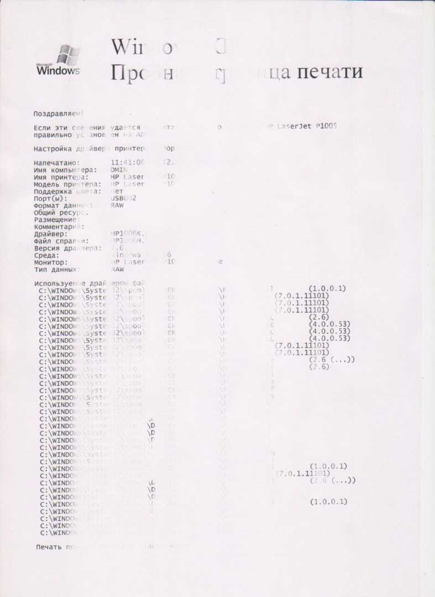

# Основные выявлениые виды дефектов :

1. Линии повышения интенсивности :

2. Линии понижения интенсивности :

Они могут быть как сплошные, так и нет : 

И также они могут различаться по своей интенсивности изменения :

3. Кляксы :

Также могут быть различны по интенсивности :

4. Периодичные (синусоподобные) стуктуры :

