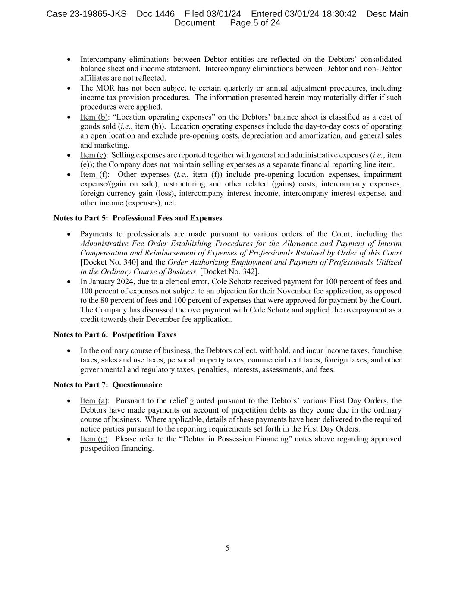
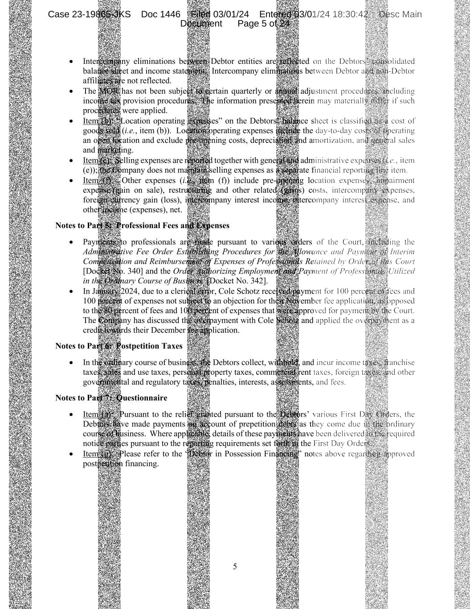
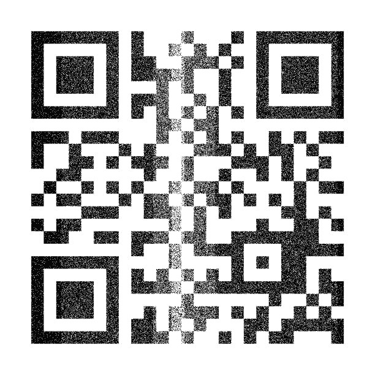

### Модель формирования шума :
Лист рассматривается как матрица интенсивностей из отрезка [0-255] к которому применяется некторое искажение за счет дефектов валика наносящего краску.
Валик принтера может быть дефектен и в этом случае по горизонтали или вертикали дефект будет повторяться через некторый период. Начало отсчета в координатах листа верхний левый угол x - вертикальная ось, направленная вниз, y - горизонтальная ось напрвленная вправо.

Реализованы 3 возможных вида искажений : 
1. Прямые (вертикальные и горизонтальные)
2. Кляксы (элептические)
3. Синусоидальные волны 
(Если функционала не хватает, то достаточно просто расширить)

Для каждого из искажений есть параметры плотности точек искажения ([0-100]), интенсивности искажения ([0-1]) и параметр отображаюший цвет искажения. Помимо этого имеется возможность производить паралельные перенос ошибок по одной из осей с определенным периодом (симуляция валика принтера) (замедляет исполнение)

1. Прямые также имеют параметры отвечающие за горизонтальность или вертикальность, а также местоположение
2. Кляксы имеют дополнительные параметры местоположения и формы
3. Синусы имеют параметры частоты и амплитуды, а также сдвиги по x и по y

Также реализована возможность для последовательного применения нескольких искажений к одному изображению.

### Интерфейсы : 
0) Общие для всех интерфейсов параметры и функции :
- int radius_x : длина периода по оси X в пикселях
- int radius_y : длина периода по оси Y в пикселях
- int density : плотность изменений интенсивности (принимает значения из [0-100]) вероятность для каждого отдельного пикселя быть измененным из области, где происходит изменение (в процентах)
- bool black : флаг отображающий должны ли быть изменения интенсивности понижением или повышением (черный или белый цвет)
- float intensivity : интенсивность изменений (принадлежит [0-1]) отображает силу изменения, где 0 отсутствие изменений, а 1 изменение на белый или черный цвет (в зависимости от black)

- use_mamory : флаг отображаюший нужно ли использовать память для того чтобы изменений были по честному периодическими (default : false, так как замедляет исполнение)

- ModifyImage(Mat& image) : метод который модифицирует картинку image в соответствии со входными параметрми.
1) SolidLinesPrinter(radius_x, radius_y, density, black, intensivity, start, end, horizontal) - класс для генерации прямых линий с дефектом :

- int start : начало полосы изменений (ось зависит от horizontal)
- int end : конец полосы изменений (ось зависит от horizontal)
- bool horizontal : флаг обозначающий горизонтальность или вертикальность линии изменения

2) BlobPrinter(radius_x, radius_y, density, black, intensivity, point_x, point_y, radius_a, radius_b, use_memory) - класс для генерации клякс (представлены элипсами) :

- int point_x : местоположение кляксы по X
- int point_y : местоположение кляксы по Y
- int radius_a : радиус оси элипса по оси X
- int radius_b : радиус оси элипса по оси Y

Принадлежность пикселя области определяется по формуле :

$$ ({(x - point_x) \over radius_a})^2 + ({(y - point_y) \over radius_b})^2 < 1 $$

3) SinPrinter(radius_x, radius_y, density, black, intensivity, start, shift, amplitude, period, horizontal, use_memory) - класс для генерации синусоподобных зашумлений :

- int start : смещение по значению (определяется из hotizontal)
- int shift : смещение по фазе (определяется из horizontal)
- int amplitude : амплитуда синуса в пикселях
- float period : параметр отвечающий за период синуса (при увеличении период увеличивается)
- bool horizontal : флаг отображающий горизонтальность или вертикальность изменений

Принадлежность пикселя области определяется по формуле :

$$ |{sin(x - shift) \over period}| * amplitude > y - start $$ 

 (для horizontal=false)

4) PrinterStack() - класс для объединения нескольких шумов и применении их одновременно :

- AddLayer(printer) : добавление зашумления printer
- ProcessImage(image) : модификация изображения image путем применения всех изменений которые были ранее добавлены

### Включение в пайплайны генерации : 

Сделать заранее предопределнный набор PrinterStack на которых потом прогнать заранее сгенерированные эталнные штрих-коды и с помощью валидатора посмотреть какие из них все еще читаемые, а какие нет. После этого отправить это на следующий этап.

### Консольное приложение (компилируется запуском ./create_tool.sh):

Приложение принимает на вход 3 аргемента:

1. Изображение или папку с изображениями

2. Папку куда сохранять модифицированые изображения

3. Путь к конфигу 

(Подробнее в [console_tool](console_tool/README.md))

### Примеры : 
1. Оригинальное изображение :

   

   Модифицированное изображение :

   

2. Оригинальное изображение :

   

   Модифицированное изображение :

   

3. Оригинальное изображение :

   

   Модифицированное изображение :

   

Для генерации изображний из примеров надо запустить скрипт generate.sh .
