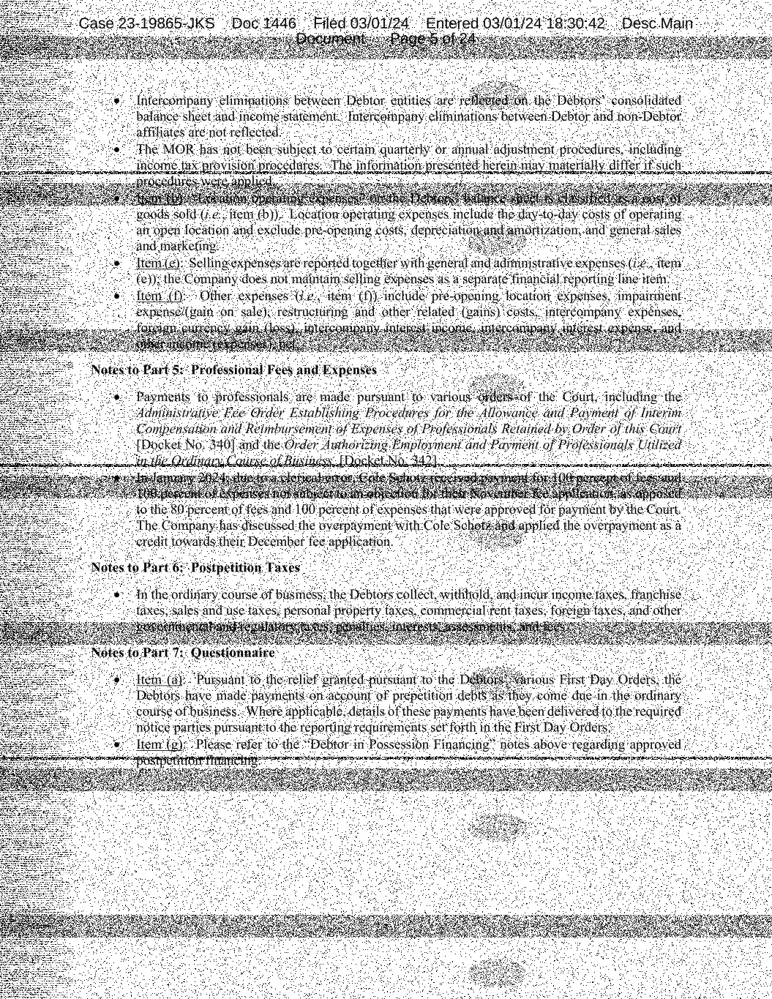

Реализованы 3 возможных вида искажений : 
1. Прямые (вертикальные и горизонтальные)
2. Кляксы (элептические)
3. Синусоидальные волны 

Для каждого из искажений есть параметры плотности точек искажения ([0-100]), интенсивности искажения ([0-1]) и параметр отображаюший цвет искажения. Помимо этого имеется возможность производить паралельные перенос ошибок по одной из осей с определенным периодом (симуляция валика принтера) (замедляет исполнение)

1. Прямые также имеют параметры отвечающие за горизонтальность или вертикальность, а также местоположение
2. Кляксы имеют дополнительные параметры местоположения и формы
3. Синусы имеют параметры частоты и амплитуды, а также сдвиги по x и по y

Также реализована возможность для последовательного применения нескольких искажений к одному изображению.

### Примеры : 
1. Оригинальное изображение :

   

   Модифицированное изображение :

   

2. Оригинальное изображение :

   

   Модифицированное изображение :

   

3. Оригинальное изображение :

   

   Модифицированное изображение :

   

Для генерации изображний из примеров надо запустить скрипт generate.sh .